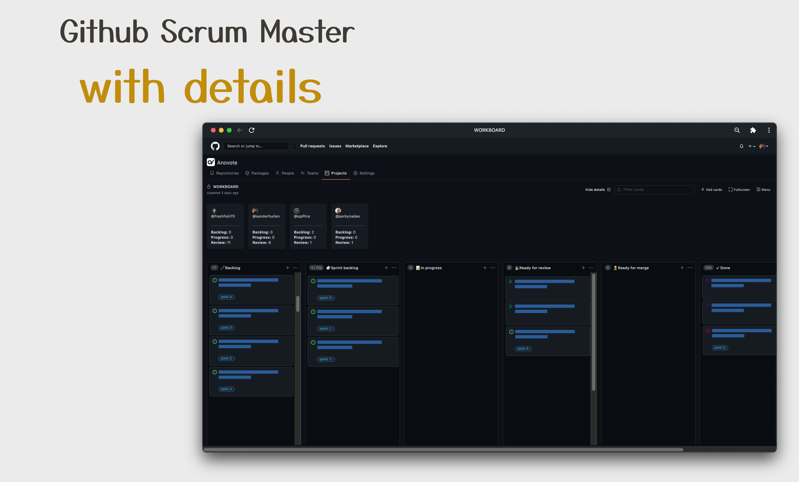
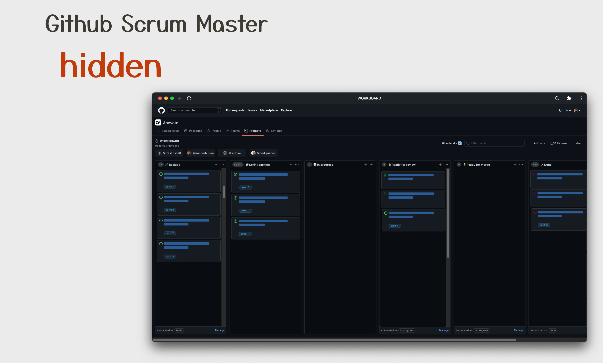

# Github SCRUM master

Become a SCRUM master on GitHub with these handy features

## Current features

1. **[STORY POINTS]**
Sums up all story points for a current sprint, and insert the number next to the board count (in Project view)
2. **[DETAILS OVERVIEW]**
Display details for the current sprint. Each collaborator participating in a project will have its summed up story points in sprint backlog, in progress and ready for review column.

3. **[PROJECT REMINDER]**
Remind and automatically open the "projects dropdown" for forcing you to add a project.

### Screenshots

## Motivation

 For our bachelor project where we developed Anovote, we wanted to use GitHub's project management tools for organizing our project. GitHub has a very nice project management tool with project board, labels, issue and pull-requests tracking integrated. And since most open source projects rely heavily on GitHub, we thought exploring GitHub could be very instructive.
 For our bachelor project we had decided on using SCRUM as our project methodology. With sprints, story points, backlog, standups, sprint review and retrospective, SCRUM demanded some features GitHub would not provide to use out of the box. This is where our side project started.

Coming from a platform like Jira, some features like story point integration, story points calculation for each sprint and developer was missing. Although most of this can easily be replicated with labels, we wanted the labels to do more. Calculate how many points each of us has in our current sprint, in progress and ready for review..

Another functionality we relied heavily upon was to remember to add the issue or pull request to the project board. We wanted only one project board for our organization. This means that for every issue or pull-request created we had to make sure a project was added.

These basic functionalities was our main motivation for developing this chrome extension. Although it is "quick and dirty" extension, it actually solves the problems we faced with our project organization and became a very nice side project for our bachelor thesis.

– written by Sander Hurlen (@sanderhurlen)

## Prerequisites

This extension needs a bit of setup. In order to utilize all the features you need to:

1. Set up a project board with the following columns:

   - *Sprint backlog*
   - *In progress*
   - *Ready for review*

2. Add labels of type: "point: *number*" with all your different point sequences.

    - This label is required for calculating and populating story points for details view. The point labels
    - For our project, we used the fibonacci sequence for our labels: 0, 1, 2, 3, 5, 8, 13, 21

3. Set the correct data-id for all columns you want the extension to use.
    - Use the dropdown when clicking the extension logo for choosing default settings.
    - The data id for each of the column is automatically provided in the dropdowns.
    - If you are unsure of which of the data id a column belongs to, this can be found by inspecting the element.

## How to install

1. Clone repo to your computer
2. go to [extensions](chrome://extensions)
3. in the top right corner, enable developer mode
4. load the folder with manifest (typically, github-scrum-master folder) as an extension
5. start using it
